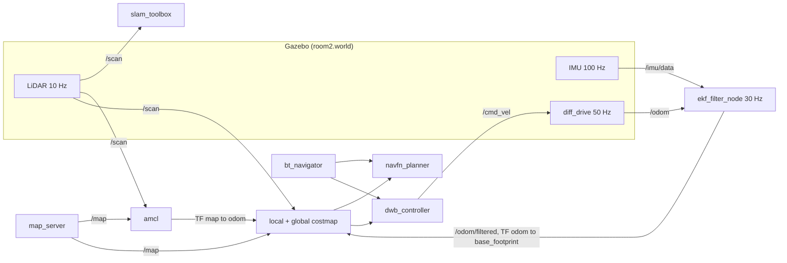

<div align="center">

# Eldercare Robot — SLAM & Navigation

**A simulated indoor care robot that maps a 29.7 × 4.9 m apartment floor with `slam_toolbox`, fuses wheel odometry and IMU through an EKF, and drives it autonomously with Nav2 — instrumented so every node's CPU, RAM and modelled power draw is recorded.**

[](https://docs.ros.org/en/rolling/Releases/Release-Dashing-Diademata.html)
[](https://releases.ubuntu.com/18.04/)
[](http://gazebosim.org/)
[](https://docs.nav2.org/)
[](https://github.com/SteveMacenski/slam_toolbox)
[](LICENSE)


</div>

---

## Overview

`elder_robot` is a complete ROS 2 navigation stack for a four-wheel differential-drive indoor assistance robot, built and evaluated **entirely in simulation**. It covers the full pipeline a service robot needs before it touches hardware: build a metric map of an apartment, keep a consistent pose estimate inside it, and plan and execute collision-free motion to a goal.

What separates this repository from a stock Nav2 bringup is the third layer. Three purpose-built monitoring nodes record per-process CPU and memory against explicit experiment stages, and a fourth integrates an analytical energy model over the robot's own filtered odometry — so the stack is not only demonstrated but *characterised*.

> [!NOTE]
> This is a simulation-only study. No physical robot was built. The hardware names appearing in the power model (Jetson Nano, RPLiDAR S2E, BNO055) are **inputs to an analytical estimate**, not measurements from real devices.

---

## System architecture

Nine ROS 2 nodes, brought up in a fixed order by `launch/sim_navigation.launch.py`.



The transform chain is `map → odom → base_footprint → base_link → {chassis, wheels}`. Ownership is split deliberately: the Gazebo `diff_drive` plugin publishes `/odom` but has `publish_odom_tf` set to **false**, so the EKF is the sole publisher of `odom → base_footprint`, and AMCL is the sole publisher of `map → odom`. This avoids the duplicate-transform conflict that breaks a naïve `robot_localization` + Nav2 setup.

| Component | Package | Owns |
|---|---|---|
| `slam_toolbox` | `slam_toolbox` | Map construction, pose graph, loop closure |
| `ekf_filter_node` | `robot_localization` | Fused local odometry, `odom → base_footprint` |
| `amcl` | `nav2_amcl` | Global localization, `map → odom` |
| `navfn_planner` | `nav2_navfn_planner` | Global path (Dijkstra) |
| `dwb_controller` | `nav2_dwb_controller` | Local trajectory and `/cmd_vel` |
| `bt_navigator` | `nav2_bt_navigator` | Behaviour-tree task orchestration |
| `imu_reader` | `elder_robot` | Quaternion → Euler conversion, `/imu/euler` |

---

## Robot platform

All values are taken from `urdf/sim.urdf`. This describes a **simulated** model, not a physical build.

| Property | Value |
|---|---|
| Drive | 4-wheel differential (rear wheels actuated), `libgazebo_ros_diff_drive.so` @ 50 Hz |
| Chassis | 0.185 × 0.166 × 0.24 m, 4.5 kg |
| Wheels | radius 0.032 m, width 0.025 m, separation 0.191 m, max torque 20 N·m |
| LiDAR | 720 samples over 360°, range 0.3–20 m, 10 Hz → `/scan` |
| IMU | 100 Hz, Gaussian noise σ = 0.01 on angular velocity and linear acceleration → `/imu/data` |
| Camera | 800 × 800 px, 30 Hz, HFOV 1.396 rad (≈80°) → `/camera1/image_raw` |
| Footprint used by Nav2 | `robot_radius` 0.14 m |

The camera is modelled and published but is not consumed by the SLAM or navigation pipeline; it is present for future perception work and is visualised in RViz2.

---

## Method

### Mapping — `config/mapper_params_online_async.yaml`

Asynchronous pose-graph SLAM with a Ceres back end.

Keyframe gating at 0.5 m / 0.5 rad is the parameter doing the most work here: it caps graph growth so that node count scales with distance travelled rather than with wall-clock time, which is what keeps memory growth linear during the mapping run measured below.

### Localization — `config/ekf.yaml` and `config/nav2_config.yaml`

The EKF fuses only the states each sensor actually observes well:

| Source | Topic | States fused |
|---|---|---|
| Wheel odometry | `/odom` | `vx`, yaw rate |
| IMU | `/imu/data` | roll, pitch, yaw, and all three angular rates |

Output is remapped to `/odom/filtered`.

Global localization uses AMCL with a `likelihood_field` sensor model.

### Navigation — `config/nav2_config.yaml`

| Layer | Choice |
|---|---|
| Global planner | `navfn_planner` (Dijkstra) | 
| Local controller | `dwb_controller` | 
| Goal tolerance | — | 
| Local costmap | rolling |
| Global costmap | static | 

The resulting behaviour tracks the global path tightly and prioritises final heading alignment, rather than cutting corners toward the goal.


### Launch orchestration

ROS 2 Dashing predates the lifecycle-event handlers later distributions use to sequence bringup, so ordering is enforced with explicit `TimerAction` delays. These offsets are load-bearing — shortening them causes nodes to start before their transforms or the Gazebo world exist.

| Launch file | t = 0 s | Delayed starts |
|---|---|---|
| `sim_slam.launch.py` | Gazebo, `robot_state_publisher`, RViz2 | spawn @ 3 s → `slam_toolbox` @ 10 s |
| `sim_navigation.launch.py` | Gazebo, `robot_state_publisher`, RViz2 | spawn @ 7 s → `imu_reader` + EKF @ 10 s → Nav2 bringup @ 15 s |

---

## Results

Two runs are committed in [`benchmark_results/`](benchmark_results). 

> **Both exclude `gzserver`, `gzclient` and `rviz2`** — the figures characterise the ROS 2 stack, not the total simulation load.

Values below are read from the committed charts, so treat them as approximate to roughly ±0.5 % CPU and ±2 MB RAM.

### SLAM run — 220 s, 2 processes monitored

Stages: start 0 s → mapping begins ≈18 s → loop closure marked ≈197 s.

| Process | CPU (idle) | CPU (mapping) | CPU (peak) | RAM |
|---|---|---|---|---|
| `async_slam_toolbox_node` | ≈4–5 % | ≈5–9 % | ≈18.7 % @ 193 s | 61.3 → 66.0 MB |
| `robot_state_publisher` | ≈1 % | ≈1–2 % | ≈2 % | 24.7 MB (flat) |

### Navigation run — 209 s, 9 processes monitored

Stages: start 0 s → motion begins ≈38 s. Nav2 becomes visible to the monitor at ≈20 s, matching the 15 s bringup delay.

| Process | CPU (steady state) | RAM (plateau) |
|---|---|---|
| `dwb_controller` | ≈13–16 % | ≈147 MB |
| `navfn_planner` | ≤ ≈3 % | ≈102 MB |
| `bt_navigator` | ≤ ≈3 % | ≈85 MB |
| `amcl` | ≤ ≈3 % | ≈85 MB |
| `robot_state_publisher` | ≤ ≈2 % | ≈38 MB |
| `ekf_filter_node`, costmaps, `imu_reader` | ≤ ≈2 % each | low |
| **Total** | **≈20–22 %** | **≈455 MB** |

Two transients appear during bringup — ≈34.5 % at 24 s and ≈28 % at 30 s — as the lifecycle manager activates the stack. Steady-state cost is dominated by `dwb_controller`, which is ≈70 % of total CPU: trajectory sampling at 20 × 20 candidates over a 1.7 s horizon is the single most expensive operation in the navigation loop. RAM is flat after 35 s, so the navigation stack has no growth term.

CPU percentages are host-dependent and the benchmark host's CPU model was not recorded. Fill in `<LAPTOP_CPU_MODEL>` and `<LAPTOP_RAM_GB>` before quoting these figures comparatively.

---

## Requirements

| Requirement | Version | Notes |
|---|---|---|
| OS | Ubuntu 18.04 LTS | Tier-1 platform for Dashing |
| ROS 2 | Dashing Diademata | Reached end of life 31 May 2021 |
| Gazebo | `<GAZEBO_VERSION>` | Version used was not recorded |
| ROS packages | `gazebo_ros`, `robot_state_publisher`, `joint_state_publisher`, `xacro`, `robot_localization`, `slam_toolbox`, `nav2_bringup`, `nav2_map_server`, `teleop_twist_keyboard` | |
| Python | `psutil`, `pandas`, `matplotlib`, `numpy` | Benchmarking scripts only — see `requirements.txt` |

> [!WARNING]
> `package.xml` currently declares only a subset of these. `slam_toolbox`, `nav2_bringup`, `nav2_map_server` and `teleop_twist_keyboard` are **not** listed, so `rosdep install` will not fetch them on a clean machine. Install them explicitly with `apt install ros-dashing-<package>`.

---

## Quick start

```bash
mkdir -p ~/ros2_ws/src && cd ~/ros2_ws/src
git clone https://github.com/NithanNguyen/eldercare-robot-slam-nav.git elder_robot
cd ~/ros2_ws && colcon build --symlink-install --packages-select elder_robot
source install/setup.bash
ros2 launch elder_robot sim_slam.launch.py
```

Drive the robot to build a map, then save it:

```bash
ros2 run teleop_twist_keyboard teleop_twist_keyboard
ros2 run nav2_map_server map_saver -f $(ros2 pkg prefix elder_robot)/share/elder_robot/maps/my_map
```

Then navigate on the saved map and set goals with the **2D Nav Goal** tool in RViz2:

```bash
ros2 launch elder_robot sim_navigation.launch.py
```

<details>
<summary><b>Running the benchmarks</b></summary>

```bash
chmod +x scripts/monitor_sim_slam.py scripts/monitor_sim_nav.py scripts/monitor_power_ros2.py

# During a SLAM run. Press ENTER to mark the loop-closure stage.
python3 scripts/monitor_sim_slam.py --nodes async_slam_toolbox_node robot_state_publisher

# During a navigation run. Motion detection on /cmd_vel marks stage 2 automatically.
python3 scripts/monitor_sim_nav.py --nodes amcl dwb_controller bt_navigator navfn_planner \
    ekf_filter_node local_costmap global_costmap robot_state_publisher imu_reader

# Energy model. Requires the navigation stack (subscribes to /odom/filtered).
python3 scripts/monitor_power_ros2.py
```

Each script writes a timestamped CSV and PNG to the working directory on `Ctrl-C`. Add `gzserver` or `rviz2` to `--nodes` to include the simulator in the measurement.

</details>

<details>
<summary><b>Alternative teleoperation</b></summary>

`scripts/robot_teleop.py` is a minimal in-repo alternative to `teleop_twist_keyboard`, fixed at 0.2 m/s linear and 0.5 rad/s angular, with `w`/`a`/`s`/`d` bindings and `space`/`x` to stop.

</details>

---

## Repository structure

```text
├── launch/
│   ├── sim_slam.launch.py         # Gazebo + slam_toolbox + RViz2
│   └── sim_navigation.launch.py   # Gazebo + EKF + Nav2 + RViz2
├── config/                        # Authoritative tuning
│   ├── mapper_params_online_async.yaml   # slam_toolbox / Ceres
│   ├── ekf.yaml                   # robot_localization sensor fusion
│   ├── nav2_config.yaml           # AMCL, DWB, NavFn, costmaps
│   └── slam_config.rviz           # RViz2 layout
├── params/                        # Legacy TurtleBot3 baseline, unused
├── urdf/sim.urdf                  # elderbot: chassis, wheels, LiDAR, IMU, camera
├── worlds/                        # room2.world (used), simple_world.world
├── models/                        # exp_empty_rooms/, dynamic_obstacle/
├── maps/                          # my_map.pgm 595x97 @ 0.05 m/px, my_map.yaml
├── scripts/
│   ├── imu_reader.py              # /imu/data -> /imu/euler
│   ├── robot_teleop.py            # Keyboard teleoperation
│   ├── monitor_sim_slam.py        # Staged CPU/RAM benchmark, SLAM
│   ├── monitor_sim_nav.py         # Staged CPU/RAM benchmark, navigation
│   └── monitor_power_ros2.py      # Analytical energy model
├── assets/                        # Demo GIFs and screenshots
├── CMakeLists.txt
└── package.xml
```

---

## References

1. S. Macenski and I. Jambrecic, "SLAM Toolbox: SLAM for the dynamic world," *Journal of Open Source Software*, 6(61), 2783, 2021. [doi:10.21105/joss.02783](https://doi.org/10.21105/joss.02783)
2. S. Macenski, F. Martín, R. White and J. Ginés Clavero, "The Marathon 2: A Navigation System," *IEEE/RSJ IROS*, 2020, pp. 2718–2725. [arXiv:2003.00368](https://arxiv.org/abs/2003.00368)
3. T. Moore and D. Stouch, "A Generalized Extended Kalman Filter Implementation for the Robot Operating System," in *Intelligent Autonomous Systems 13*, Springer, 2016, pp. 335–348.
4. ROS 2 Dashing Diademata release announcement, Open Robotics, 31 May 2019.

The Nav2 parameter set was derived from the TurtleBot3 simulation baseline; the retained `params/nav2_params_base.yaml` preserves that lineage, including its reference to [`turtlebot3_simulations` issue #75](https://github.com/ROBOTIS-GIT/turtlebot3_simulations/issues/75).

---

## License

Licensed under the Apache License 2.0, as declared in `package.xml`. See [`LICENSE`](LICENSE).

## Author

`Nguyen Pham Thien An` — `npthienan257@gmail.com`
